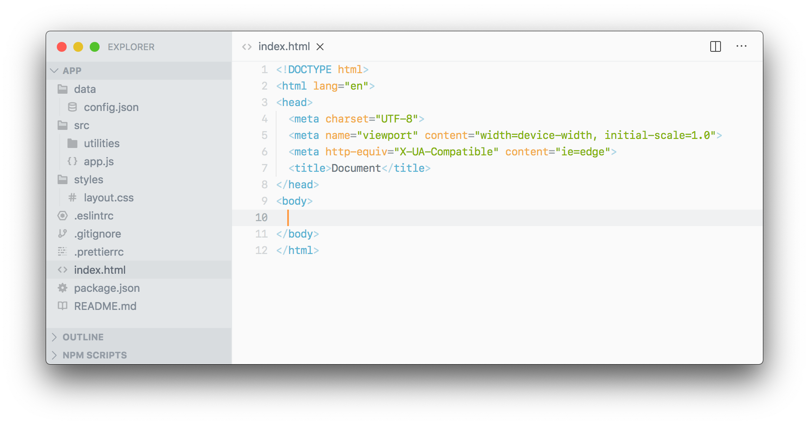
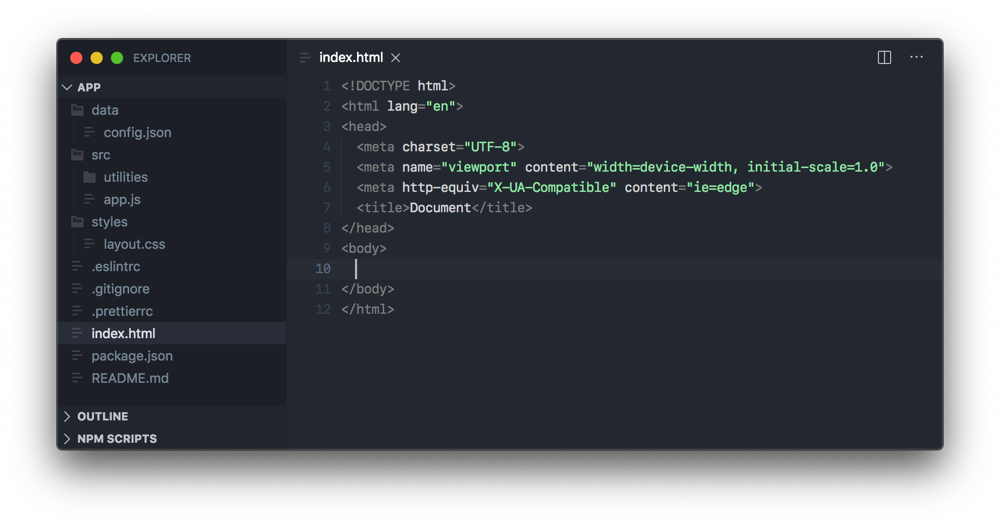
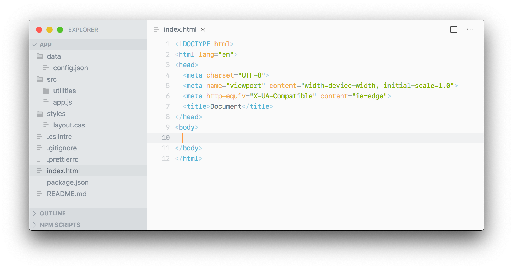

<h1 style="display:flex; align-items: center;">
  
  Quill Icons
</h1>

A light/dark file icon set for VSCode that borrows from and extends [Feather Icons](https://feathericons.com). A minimal icon theme is also included that only differentiates files and folders.

### Screenshots

#### Full icon theme

>  > 

#### Minimal icon theme

>  > 

### Icon reference

| Name            | Icon                                        | Purpose                                                                                                              |
| --------------- | ------------------------------------------- | -------------------------------------------------------------------------------------------------------------------- |
| Folder          |            | Collapsed Folders                                                                                                    |
| Folder (Open)   |  | Expanded Folders                                                                                                     |
| File            |                | Fallback for files not decorated by another icon. In the minimal theme, it represents anything that is not a folder. |
| Settings        |        | `package.json` and other configuration-related files                                                                 |
| Prettier        |        | `.prettierrc`                                                                                                        |
| ESLint          |            | `eslint` configurations                                                                                              |
| Code            |                | Source code files (`.js`, `.py`, etc)                                                                                |
| Markup          |              | `.html`, `.xml`, etc                                                                                                 |
| Hash            |                | CSS related files (`.css`, `.scss`, etc)                                                                             |
| Book            |                | `.md` and other documentation files                                                                                  |
| Package/Archive |          | Package/archive files                                                                                                |
| Image           |              | Images (`.svg`. `.png`, etc)                                                                                         |
| Camera          |            | Snapshots (`.snap`)                                                                                                  |
| Database        |        | Data files (`.json`, `.sql`)                                                                                         |
| Terminal        |        | `.zshrc`, `.bashrc`                                                                                                  |
| Lock            |                | `.lock`                                                                                                              |
| Info            |                | Log files                                                                                                            |
| Git             |                  | Git-related files (`.gitignore`)                                                                                     |

## Credits

Many thanks to [@colebemis](https://github.com/colebemis) and [@feathericons](https://github.com/feathericons) for inspiration.

## License

MIT License 2019 © Chad Donohue
